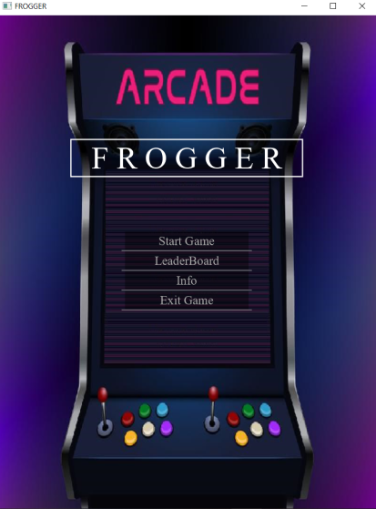
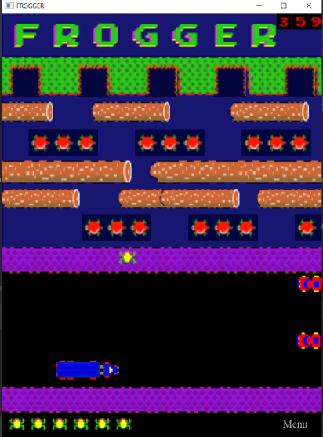
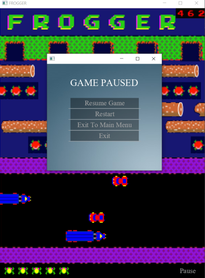
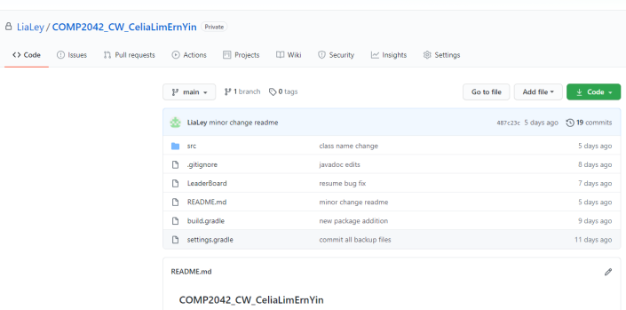
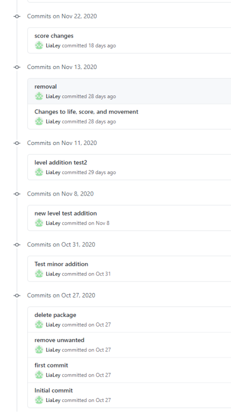

### COMP2042_CW_CeliaLimErnYin

### Screenshots of Game 
---

### Refactoring/Changes to Original Code
---
- Packaging

Related classes were packaged together.
1. **actors** - classes that define objects visible on the stage.
   
   - **actors.active** - classes of actors that shows movement. Eg. Player, Car
   - **actors.passive** - classes of actors that are static. Eg. Background Image, Lives

2. **world** - classes that defines the stage display. 

3. **menu** - classes used to define construction of Menus

4. **sound** - Contains the MediaPlay class that plays background music

5. **application** - Contains the Main class that runs the game.

- Breaking up of Classes

To improve encapsulation and promote single responsibility, large classes like Player was broken down. An additional AnimationIterator class separately controls the animations.
The Obstacle class was also broken down to two. A MediaPlay class was also specifically added for playing music.  

- Design Patterns 

Included an MVC pattern. A controller class controls and show the Info window that was build using scene builder. 

- Naming Convention Changes

Some naming conventions were changed to avoid confusion and disorientation.
Eg. MyStage was renamed MyLevel to avoid confusion with the JavaFX Stage class. Animal class was also renamed Player.

- Scoring System

Points will now be added based on distance (along the vertical plane) travelled by the player during each round in addition to the 
points earned when winning each level.

- Winning System

Changes were made so that frog holes can no longer be activated for a second time. 

- Display of scores

Made changes on the display of scores so that the images of scores would not overlay each other.

- Animation of Frog

A separate AnimationIterator class was created to handle the animation of the movements of the frog.
Images of the frog are now stored in an array to be looped every frame to form an animation.

- Movement on Obstacles

Instead of fixing the speed of the frog, we will get the speed of the obstacles and assign it to the frog so it will move in time with the obstacle.

### Additions
---

- Main Menu 

Added a Main Menu with options to start the game, exit the game, access the leaderboard or the info Menu.

- LeaderBoard

Added a permanent Leaderboard displaying all the scores of the players in order.
The scores are stored in a file and loaded each time the game application starts.

- Information Menu

Added an Info Menu using that shows the simple operations of the game. A controller class controls the functions of the Info Menu.

- Pause Menu

Added a mid-game pause Menu so players can pause, resume, restart the game, exit to the main menu or exit the game entirely.

- Additional Levels

Added additional levels with different levels of difficulty.
The levels are repeated infinitely, and the game only ends once the player loses.

- Lives

A Lives system is added and the player only loses once all lives are lost. The lives are displayed at the bottom of the window for the players.

- Sound effects

Added a few more additional sound effect to indicate the change in levels, wins and Game-Overs.

- Junit Testings

Added additional Junit tests for a few classes

- Build Files

Added Gradle build files for the project 

### GitHub/Version Control
---

