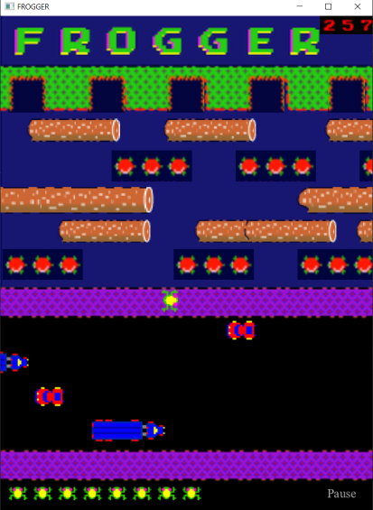

### COMP2042_CW_CeliaLimErnYin

### Screenshot of Game 
---

### Refactoring 
---
- <h4>Packaging</h4>

Originally the classes were all cluttered together under one package. Therefore, I packaged related classes together.
1. **actors** - Contains classes that will define objects that will be visible on the stage (window).
   
   - **actors.active** - Contains classes of actors that shows movement in the stage. Eg. Animal, Car
   - **actors.passive** - Contains classes of actors that are static in the stage. Eg. Background Image, Lives

2. **world** - Contains classes that defines the stage setting. Eg. LevelType1, MyLevel, World

3. **menu** - Contains classes used to define construction of Menus

4. **sound** - Contains the MediaPlay class that plays background music

5. **application** - Contains the Main class that runs the game.

- <h4>Breaking up of Classes</h4>  

To improve encapsulation and promote single responsibility, large classes like Animal was broken down. An additional AnimationIterator class was added to separately control the animations of the animal.
The Obstacle class was also broken down to a Car class and a Truck class. 
A MediaPlay class was also added for playing music to promote single responsibility.  

- <h4> Design Patterns</h4> 

Included an MVC pattern to control the MainMenu and show the Info window using scene builder. 

- <h4>Naming Convention Changes</h4>
The naming convention for a few methods, fields and classes were changed to avoid confusion. 
Eg. MyStage was changed to MyLevel to avoid confusion with the Stage class in JavaFX.
The stop() and start() method in Main class were also changed to stopGame() and startGame() to avoid 
confusion with the stop() and start() method of the timer in World class.

### Code Maintenance
---

- Scoring System

Made changes to the scoring system where points will be added based on travel distance (along the vertical plane) by the player in each round in addition to the 
points earned after winning each level.

- Winning System

Previously, there was a bug where frog holes that have been filled can still be entered by the frog.
Changes were made so that frog holes can no longer be activated for a second time. 

- Display of scores

Made changes on the display of scores so that the images of scores would not overlay each other.

- Animation of Frog

Made changes in the animation of the frog. A separate class was created to handle the animation of the movements of the frog.
Images of the frog are now stored in an array to be looped every frame to form an animation.

- Movement on Obstacles

Made changes to the code defining the movement of the frog when standing on obstacles. Instead of fixing the speed of the frog, we will get the speed of the obstacle and assigned it to the frog
so it will move in time with the obstacle.

### Additions
---

- Main Menu 

Added an interactive Main Menu for the game displaying options to start the game, exit the game, access the leaderboard or the info Menu.

- LeaderBoard

Added a Leaderboard displaying all the scores of the players after each game. The Leaderboard is a permanent score listing of the game.
The scores are stored in a file and loaded each time the game application starts.

- Information Menu

Added an Info Menu using Scence Builder to include an MVC pattern in the design. There is a controller class that controls the functions of the Info Menu.
The Info Menu shows simple information on the operations of the game.

- Pause Menu

Added a mid-game pause Menu so players can pause the game. The pause Menu also lets players restart the game , resume the game, exit back to the main menu or exit the game entirely.

- Additional Levels

Added a few more additional levels with different obstacle setting and levels of difficulty. There are currently 5 more additional Level types added and can be increased accordingly.
The levels are repeated in an infinite loop and the game only ends once the player loses.

- Lives

Lives are added and the player only loses once the game ends and all lives are lost.
The lives are displayed at the bottom of the window and players will know how many lives they have left.

- Sound effects

Added a few more additional sound effect to indicate the change in levels, wins and Game-Overs.

- Junit Testings

Added additional Junit tests for a few classes.

- Build Files

Added Gradle build files for the project 

